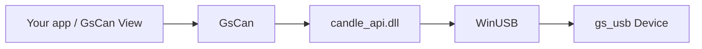

# GsCan.NET

**English** | [简体中文](README.zh-CN.md)

.NET Standard 2.0 host library for [gs_usb](https://github.com/candle-usb/candle-usb) adapters on Windows. Open a Device, start each Channel, send and read `CanFrame` — without writing P/Invoke or a USB stack.

This repository also hosts **GsCan View**, a lightweight desktop viewer that consumes the same public API. GsCan.NET is the library, not an analyzer and not a GUI.

[Features](#features) · [Install](#install) · [Quick start](#quick-start) · [GsCan View](#gscan-view) · [Building](#building) · [License](#license)


## Why

Windows has candle’s C API and python-can for gs_usb. There was no NuGet-ready .NET library that speaks CAN FD against that native surface. GsCan wraps a self-built `candle_api.dll` (WinUSB) behind four types: `Device`, `Channel`, `CanFrame`, `GsCanException`.

First-class hardware is **FlintCAN-FD** (dual-channel isolated CAN FD, hardware timestamps). Other standard gs_usb devices (CANable, candleLight, …) use the same API.



## Features

- **Small public surface** — `Device` / `Channel` / `CanFrame`. No Candle names leak into the API.
- **Classic CAN and CAN FD** — omit `DataBitrate` for classic; set it (1M / 2M / 4M) for FD, including 64-byte frames.
- **Multi-channel** — one Device, N Channels (two on FlintCAN-FD). USB IN is demuxed for you.
- **Blocking read, non-blocking send** — `Send` returns immediately; `TryRead` takes a timeout and returns `false` instead of throwing.
- **One frame type** — Rx, Echo, and Error are `CanFrameKind` values, not extra classes. Overflow is a flag on the frame that carried it.
- **Hardware timestamps** — `CanFrame.TimestampMicroseconds` when the adapter supports them.
- **Listen-only / loopback / one-shot** on `ChannelOptions`.
- **netstandard2.0** — .NET Framework 4.6.1+ and modern .NET consume the same package. Native DLLs ship for `win-x86` and `win-x64` and are copied next to your output.

### Not in v1

Linux SocketCAN, events / `IObservable`, hardware filters, IDENTIFY, software termination, `Channel.State`, bus-off recovery, DBC / UDS / ISO-TP, and a CAN analyzer GUI. GsCan View is a viewer, not that analyzer.

## Requirements

- Windows (WinUSB). The library does not run on Linux or macOS.
- A gs_usb adapter. FlintCAN-FD is the reference device.
- To **use** the library: any TFM that can reference `netstandard2.0`.
- To **build**: .NET 8 SDK. Rebuilding the native DLL also needs Visual Studio C++ tools and CMake.

## Install

The library is the `GsCan` project in this repo (package id `GsCan`). Until it is published to NuGet:

```bash
git clone https://github.com/YeEeck/GsCan.NET.git
dotnet add reference path/to/GsCan.NET/src/GsCan/GsCan.csproj
```

Or pack it locally:

```bash
dotnet pack src/GsCan/GsCan.csproj -c Release
```

`candle_api.dll` is copied beside your output automatically. You do not configure a native path.

## Quick start

```csharp
using GsCan;

var devices = Device.List();          // snapshot of adapters currently plugged in
if (devices.Count == 0)
{
    throw new InvalidOperationException("No gs_usb device found.");
}

using var device = Device.Open(devices[0]);
var ch = device.Channels[0];          // Channels exist after Open; Start puts them on the bus

ch.Start(new ChannelOptions
{
    Bitrate = 500_000,
    DataBitrate = 2_000_000,          // omit this property for classic CAN
});

ch.Send(CanFrame.Classic(0x123, new byte[] { 0x11, 0x22 }));
ch.Send(CanFrame.Fd(0x124, new byte[64]));

while (ch.TryRead(out var frame, timeoutMilliseconds: 100))
{
    // Kind is Rx, Echo, or Error — Echo is not "on the bus"
    Console.WriteLine($"{frame.Kind} id=0x{frame.Id:X} len={frame.Data.Length}");
}

ch.Stop();                            // void, does not throw
```

### Echo, Overflow, Error

| You see | It means |
|---|---|
| `Kind = Echo` | That `Send` finished **on the device**. It is not acknowledgement that the frame won arbitration. Echoes on one Channel match `Send` in FIFO order. |
| `Overflow = true` | The device dropped RX before this frame. Not an exception, not a separate type. |
| `Kind = Error` | A bus error frame (including bus-off). Same read path as data. |
| `TryRead` → `false` | Timeout. Open / `Start` / a `Send` that fails immediately throw `GsCanException` instead. |

After `Stop`, unfinished `Send` calls never produce Echo. If you care about completion, drain Echoes before stopping.

### Threading

- `Send` and `TryRead` on the same Channel may run on different threads.
- Two concurrent `TryRead` calls on one Channel are not supported.
- `Start` / `Stop` / `Dispose` must not overlap with send or read.
- `List` / `Open` are not thread-safe. Unplug during use fails in-flight calls with `GsCanException`; there are no arrival/removal events.

## API

```csharp
Device.List()                         // IReadOnlyList<DeviceInfo>  (Path, ChannelCount)
Device.Open(info)                     // IDisposable

channel.Start(options)
channel.Stop()
channel.Send(frame)
channel.TryRead(out frame, timeoutMs)

ChannelOptions                        // Bitrate, DataBitrate?, ListenOnly, Loopback, OneShot
CanFrame.Classic(id, data, extended?)
CanFrame.Fd(id, data, extended?, bitRateSwitch?)
```

Arbitration bitrates the native API accepts: 10k, 20k, 50k, 83.333k, 100k, 125k, 250k, 500k, 800k, 1M. Data bitrates for FD are **1M, 2M, 4M** (48 MHz clock).

## GsCan View

A single-window Windows x64 viewer on top of GsCan. Chinese UI; terms such as Echo / Trace / Latest / Kind stay English so they match this library.

- One Device at a time; one Channel bar per channel on that Device
- Trace (arrival order) and Latest (latest frame per key, with a count)
- Display Filter (what the window shows — not a hardware acceptance filter)
- TxSlot table: one-shot or cyclic send
- Save Trace as CSV (write-only; v1 does not open logs)
- Remembers last form values; does **not** auto-Open or auto-Start

Run from source:

```bash
dotnet run --project src/GsCan.View/GsCan.View.csproj
```

Publish a self-contained zip (`GsCan.View.exe` + `candle_api.dll` side by side, no installer, not a single-file bundle):

```powershell
powershell -ExecutionPolicy Bypass -File scripts/publish-view.ps1
```

Output: `artifacts/GsCan.View-win-x64.zip`. Unzip and run `GsCan.View.exe`. You can replace `candle_api.dll` next to the exe (LGPL).

## Building

```bash
dotnet build GsCan.sln
dotnet test GsCan.sln
```

Hardware tests skip (they do not fail) when no matching adapter is plugged in.

Rebuild the native DLL (Visual Studio C++ tools + CMake):

```powershell
powershell -ExecutionPolicy Bypass -File native/candle-api/build.ps1
```

This installs `candle_api.dll` into `src/GsCan/runtimes/win-x64/native` and, when possible, `win-x86`.

```
src/GsCan/            GsCan library (netstandard2.0)
src/GsCan.View/       GsCan View (net8.0, Avalonia, win-x64)
tests/                xUnit (library + viewer session)
native/candle-api/    vendored Candle Windows API (LGPL)
licenses/             GPL-3.0 / LGPL-3.0 texts
CONTEXT.md            glossary — use these names in issues and PRs
```

## License

The native Windows API (`candle_api.dll` and `native/candle-api/api/`) is **LGPL-3.0-or-later**, vendored from [Schildkroet/CANgaroo](https://github.com/Schildkroet/CANgaroo) `src/driver/CandleApiDriver/api/` ([commit `46eeb8b`](https://github.com/Schildkroet/CANgaroo/tree/46eeb8b570e5f0cc66a661e9b58cc2f695107807)). Corresponding source ships in-tree; see [`native/candle-api/SOURCE.txt`](native/candle-api/SOURCE.txt). License texts: [`licenses/LGPL-3.0.txt`](licenses/LGPL-3.0.txt), [`licenses/GPL-3.0.txt`](licenses/GPL-3.0.txt).

GsCan **dynamically** links that DLL so you can replace it. The GPL-2 CANgaroo Qt application is **not** included.

## Contributing

Issues and pull requests are welcome. Please use the terms in [`CONTEXT.md`](CONTEXT.md) (`Device`, `Channel`, `CanFrame`, `Echo`, `Overflow`, …) rather than synonyms the glossary lists under _Avoid_.
