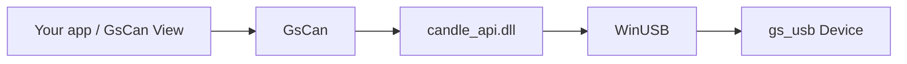

# GsCan.NET

**English** | [简体中文](README.zh-CN.md)


A .NET Standard 2.0 host library for [gs_usb](https://github.com/candle-usb/candle-usb) adapters on Windows. Open a Device, start its Channels, and send and read `CanFrame` — without writing your own P/Invoke declarations or a USB stack.

This repository also contains **GsCan View**, a lightweight desktop viewer built on the same public API. GsCan.NET itself is the library — not a CAN analyzer, and not a GUI.

[Why](#why) · [Features](#features) · [Requirements](#requirements) · [Install](#install) · [Quick start](#quick-start) · [Semantics](#semantics) · [API](#api) · [GsCan View](#gscan-view) · [Building](#building) · [Repository layout](#repository-layout) · [License](#license) · [Contributing](#contributing)

## Why

On Windows, the existing ways to reach gs_usb are candle’s C API and python-can. There was no .NET library that you could install from NuGet and use to drive CAN FD over that native layer. GsCan fills that gap: it wraps a self-built `candle_api.dll` (WinUSB) behind four types — `Device`, `Channel`, `CanFrame`, and `GsCanException`.

The reference device is **FlintCAN-FD**: dual-channel, isolated CAN FD with hardware timestamps. Any other standard gs_usb device (CANable, candleLight, and similar) uses the same API.



## Features

- **A small API to learn** — `Device`, `Channel`, `CanFrame`. No candle-specific names appear in the public surface.
- **Classic CAN and CAN FD** — leave `DataBitrate` unset for classic CAN, or set it (1M / 2M / 4M) for FD, including 64-byte frames.
- **Multiple Channels** — one Device with N Channels (two on FlintCAN-FD). The library demultiplexes the USB IN endpoint for you.
- **Non-blocking send, blocking read** — `Send` returns immediately; `TryRead` waits up to a timeout and returns `false` instead of throwing.
- **One frame type** — Rx, Echo, and Error are values of `CanFrameKind` rather than separate classes. Overflow is a flag on the frame that reports it.
- **Hardware timestamps** — exposed through `CanFrame.TimestampMicroseconds` when the adapter provides them.
- **Listen-only, loopback, and one-shot** modes, set on `ChannelOptions`.
- **netstandard2.0 only** — .NET Framework 4.6.1+ and modern .NET share the same package. Native DLLs for `win-x86` and `win-x64` are copied next to your build output.

### Out of scope for v1

Linux SocketCAN, events / `IObservable`, hardware acceptance filters, IDENTIFY, software termination, `Channel.State`, bus-off recovery, and DBC / UDS / ISO-TP. There is also no CAN analyzer GUI — GsCan View is a viewer.

## Requirements

- Windows with WinUSB. The library does not run on Linux or macOS.
- A gs_usb adapter. FlintCAN-FD is the reference device.
- To **use** the library: any target framework that can reference `netstandard2.0`.
- To **build** it: the .NET 8 SDK. Rebuilding the native DLL additionally requires the Visual Studio C++ tools and CMake.

## Install

The library is the `GsCan` project in this repository (package id `GsCan`). It is not on NuGet yet, so reference the project directly:

```bash
git clone https://github.com/YeEeck/GsCan.NET.git
dotnet add reference path/to/GsCan.NET/src/GsCan/GsCan.csproj
```

Or build a local package:

```bash
dotnet pack src/GsCan/GsCan.csproj -c Release
```

`candle_api.dll` is copied next to your build output automatically; there is no native path to configure.

## Quick start

```csharp
using GsCan;

var devices = Device.List();          // a snapshot of the adapters currently plugged in
if (devices.Count == 0)
{
    throw new InvalidOperationException("No gs_usb device found.");
}

using var device = Device.Open(devices[0]);
var ch = device.Channels[0];          // Channels exist after Open; Start puts them on the bus

ch.Start(new ChannelOptions
{
    Bitrate = 500_000,
    DataBitrate = 2_000_000,          // omit this property for classic CAN
});

ch.Send(CanFrame.Classic(0x123, new byte[] { 0x11, 0x22 }));
ch.Send(CanFrame.Fd(0x124, new byte[64]));

while (ch.TryRead(out var frame, timeoutMilliseconds: 100))
{
    // Kind is Rx, Echo, or Error — Echo does not mean "on the bus"
    Console.WriteLine($"{frame.Kind} id=0x{frame.Id:X} len={frame.Data.Length}");
}

ch.Stop();                            // void, does not throw
```

## Semantics

How to interpret the frames you read back, and which calls may run concurrently.

### Echo, Overflow, and Error

| You see | It means |
|---|---|
| `Kind = Echo` | That `Send` completed **on the device**. It does not mean the frame won arbitration. On a given Channel, Echo frames arrive in the same order as the `Send` calls. |
| `Overflow = true` | The device dropped received frames before this one. It is a flag — not an exception, and not a separate type. |
| `Kind = Error` | A bus error frame, including bus-off. It arrives through the same read path as data. |
| `TryRead` returns `false` | The read timed out. `Open`, `Start`, and a `Send` that fails immediately throw `GsCanException` instead. |

After `Stop`, a `Send` that has not yet been echoed never will be. If you need to know that your frames were sent, drain the pending Echo frames before stopping.

### Threading

- On one Channel, `Send` and `TryRead` may run on different threads.
- Two `TryRead` calls must not run concurrently on the same Channel.
- `Start`, `Stop`, and `Dispose` must not overlap with sending or reading.
- `List` and `Open` are not thread-safe. Unplugging a device during use fails the in-flight calls with `GsCanException`; there are no arrival or removal events.

## API

```csharp
Device.List()                         // IReadOnlyList<DeviceInfo>  (Path, ChannelCount)
Device.Open(info)                     // IDisposable

channel.Start(options)
channel.Stop()
channel.Send(frame)
channel.TryRead(out frame, timeoutMs)

ChannelOptions                        // Bitrate, DataBitrate?, ListenOnly, Loopback, OneShot
CanFrame.Classic(id, data, extended?)
CanFrame.Fd(id, data, extended?, bitRateSwitch?)
```

The native API accepts these arbitration bitrates: 10k, 20k, 50k, 83.333k, 100k, 125k, 250k, 500k, 800k, and 1M. FD data bitrates are **1M, 2M, and 4M** (48 MHz clock).

## GsCan View

A single-window Windows x64 viewer built on GsCan. The UI is in Chinese, but terms such as Echo, Trace, Latest, and Kind stay in English so that they match the library.

- One Device at a time, with one Channel card for each Channel on that Device
- Trace (every frame in arrival order) and Latest (the newest frame per key, with a hit count)
- Display Filter (controls what the window shows — not a hardware acceptance filter)
- A TxSlot table for one-shot or cyclic sending
- Saving a Trace as CSV (save only; v1 cannot open a Log)
- Restores the values you last entered, but never opens a Device or starts a Channel by itself

Run it from source:

```bash
dotnet run --project src/GsCan.View/GsCan.View.csproj
```

Or produce a self-contained zip (`GsCan.View.exe` with `candle_api.dll` beside it — no installer, not a single-file bundle):

```powershell
powershell -ExecutionPolicy Bypass -File scripts/publish-view.ps1
```

The result is `artifacts/GsCan.View-win-x64.zip`. Unzip it and run `GsCan.View.exe`. As the LGPL permits, you may replace the `candle_api.dll` next to the executable.

## Building

```bash
dotnet build GsCan.sln
dotnet test GsCan.sln
```

Hardware tests are skipped — not failed — when no matching adapter is plugged in.

To rebuild the native DLL:

```powershell
powershell -ExecutionPolicy Bypass -File native/candle-api/build.ps1
```

The script installs `candle_api.dll` into `src/GsCan/runtimes/win-x64/native`, and into `win-x86` when that target can be built.

## Repository layout

```
src/GsCan/            GsCan library (netstandard2.0)
src/GsCan.View/       GsCan View (net8.0, Avalonia, win-x64)
tests/                xUnit tests (library + viewer session)
native/candle-api/    Candle Windows API sources, vendored (LGPL)
licenses/             GPL-3.0 / LGPL-3.0 license texts
CONTEXT.md            glossary — use these names in issues and PRs
```

## License

The native Windows API (`candle_api.dll` and `native/candle-api/api/`) is **LGPL-3.0-or-later**, vendored from [Schildkroet/CANgaroo](https://github.com/Schildkroet/CANgaroo) `src/driver/CandleApiDriver/api/` ([commit `46eeb8b`](https://github.com/Schildkroet/CANgaroo/tree/46eeb8b570e5f0cc66a661e9b58cc2f695107807)). The corresponding source is included in this repository; see [`native/candle-api/SOURCE.txt`](native/candle-api/SOURCE.txt). License texts: [`licenses/LGPL-3.0.txt`](licenses/LGPL-3.0.txt), [`licenses/GPL-3.0.txt`](licenses/GPL-3.0.txt).

GsCan links to that DLL dynamically, so you are free to replace it. The GPL-2 CANgaroo Qt application is **not** included.

## Contributing

Issues and pull requests are welcome. Please use the terms defined in [`CONTEXT.md`](CONTEXT.md) (`Device`, `Channel`, `CanFrame`, `Echo`, `Overflow`, and so on) instead of the synonyms listed under _Avoid_.
