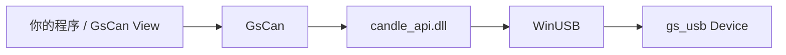

# GsCan.NET

[English](README.md) | **简体中文**


Windows 平台上的 .NET Standard 2.0 **[gs_usb](https://github.com/candle-usb/candle-usb) 主机库**。枚举 Device、启动各路 Channel、收发 `CanFrame`，不必自己写 P/Invoke 声明，也不必实现一套 USB 协议栈。

本仓库还包含 **GsCan View**：一个基于同一套公共 API 的轻量桌面查看器。GsCan.NET 指的只是这个库，既不是 CAN 分析仪，也不是上位机。

[为什么需要它](#为什么需要它) · [功能](#功能) · [环境要求](#环境要求) · [安装](#安装) · [快速上手](#快速上手) · [语义约定](#语义约定) · [API](#api) · [GsCan View](#gscan-view) · [构建](#构建) · [仓库结构](#仓库结构) · [许可证](#许可证) · [贡献](#贡献)

## 为什么需要它

在 Windows 上，托管代码接入 gs_usb 的现成方案只有 candle 的 C API 和 python-can；没有一个 .NET 库能从 NuGet 直接装上、并在这套 native 之上跑通 CAN FD。GsCan 补上了这一环：它把自建的 `candle_api.dll`（通过 WinUSB 传输 gs_usb 协议）封装在四个类型之后 —— `Device`、`Channel`、`CanFrame` 与 `GsCanException`。

参考设备是 **FlintCAN-FD**：双路隔离 CAN FD，带硬件时间戳。其他标准 gs_usb 设备（CANable、candleLight 等）使用同一套 API。



## 功能

- **公共 API 面很小** —— 只需掌握 `Device` / `Channel` / `CanFrame`，公共命名里不会出现 candle 相关词汇。
- **经典 CAN 与 CAN FD** —— 不设置 `DataBitrate` 即为经典 CAN；设置后（1M / 2M / 4M）为 FD，可发送 64 字节帧。
- **多 Channel** —— 一个 Device 带 N 路 Channel（FlintCAN-FD 为两路），USB IN 端点的分路由库内部完成。
- **发送不阻塞、读取带超时** —— `Send` 立即返回；`TryRead` 超时返回 `false`，不抛异常。
- **只有一种帧类型** —— Rx、Echo、Error 都是 `CanFrameKind` 的取值，而不是额外的类；Overflow 是所在帧上的一个标志位。
- **硬件时间戳** —— 适配器支持时，通过 `CanFrame.TimestampMicroseconds` 提供。
- **ListenOnly / Loopback / OneShot** —— 均在 `ChannelOptions` 上设置。
- **只面向 netstandard2.0** —— .NET Framework 4.6.1+ 与现代 .NET 共用同一个包；native DLL 提供 `win-x86` 与 `win-x64`，会自动复制到输出目录旁。

### v1 暂不支持

Linux SocketCAN、事件 / `IObservable`、硬件验收滤波、IDENTIFY、软件端接、`Channel.State`、bus-off 恢复，以及 DBC / UDS / ISO-TP。也没有 CAN 分析仪界面 —— GsCan View 只是查看器。

## 环境要求

- Windows（依赖 WinUSB）。本库不支持在 Linux 与 macOS 上运行。
- 一块 gs_usb 适配器；参考设备为 FlintCAN-FD。
- **使用**本库：目标框架能引用 `netstandard2.0` 即可。
- **构建**本库：需要 .NET 8 SDK；若还要重新编译 native DLL，则另需 Visual Studio C++ 工具与 CMake。

## 安装

库就是本仓库中的 `GsCan` 工程（包 id 为 `GsCan`）。在发布到 NuGet 之前，请直接引用该工程：

```bash
git clone https://github.com/YeEeck/GsCan.NET.git
dotnet add reference path/to/GsCan.NET/src/GsCan/GsCan.csproj
```

或在本地打包：

```bash
dotnet pack src/GsCan/GsCan.csproj -c Release
```

`candle_api.dll` 会自动复制到输出目录旁，无需配置 native 路径。

## 快速上手

```csharp
using GsCan;

var devices = Device.List();          // 当前已插入适配器的快照
if (devices.Count == 0)
{
    throw new InvalidOperationException("No gs_usb device found.");
}

using var device = Device.Open(devices[0]);
var ch = device.Channels[0];          // Open 之后 Channel 就已存在，Start 之后才上总线

ch.Start(new ChannelOptions
{
    Bitrate = 500_000,
    DataBitrate = 2_000_000,          // 经典 CAN 不设置此属性
});

ch.Send(CanFrame.Classic(0x123, new byte[] { 0x11, 0x22 }));
ch.Send(CanFrame.Fd(0x124, new byte[64]));

while (ch.TryRead(out var frame, timeoutMilliseconds: 100))
{
    // Kind 为 Rx / Echo / Error —— Echo 并不表示“已上总线”
    Console.WriteLine($"{frame.Kind} id=0x{frame.Id:X} len={frame.Data.Length}");
}

ch.Stop();                            // 返回 void，不抛异常
```

## 语义约定

如何理解读回的帧，以及哪些调用可以并发执行。

### Echo、Overflow 与 Error

| 现象 | 含义 |
|---|---|
| `Kind = Echo` | 对应的 `Send` **已在设备上完成**，并不代表该帧赢得了仲裁。同一 Channel 上，Echo 的到达顺序与 `Send` 的调用顺序一致。 |
| `Overflow = true` | 在这一帧之前，设备丢弃过收到的帧。它是一个标志位，既不是异常，也不是独立类型。 |
| `Kind = Error` | 总线错误帧（含 bus-off），与数据帧走同一条读取路径。 |
| `TryRead` 返回 `false` | 读取超时。`Open`、`Start` 以及立即失败的 `Send` 则会抛出 `GsCanException`。 |

调用 `Stop` 之后，尚未回 Echo 的 `Send` 不会再有 Echo。如果需要确认帧是否发出，请先读完 Echo 再停止。

### 线程模型

- 同一个 Channel 上，`Send` 与 `TryRead` 可以分别在不同线程执行。
- 同一个 Channel 上，不允许两个 `TryRead` 并发执行。
- `Start` / `Stop` / `Dispose` 不得与收发操作重叠。
- `List` / `Open` 不是线程安全的。使用过程中拔出设备，正在执行的调用会以 `GsCanException` 失败；库不提供设备插入 / 拔出事件。

## API

```csharp
Device.List()                         // IReadOnlyList<DeviceInfo>（Path、ChannelCount）
Device.Open(info)                     // IDisposable

channel.Start(options)
channel.Stop()
channel.Send(frame)
channel.TryRead(out frame, timeoutMs)

ChannelOptions                        // Bitrate、DataBitrate?、ListenOnly、Loopback、OneShot
CanFrame.Classic(id, data, extended?)
CanFrame.Fd(id, data, extended?, bitRateSwitch?)
```

native 层接受的仲裁波特率：10k、20k、50k、83.333k、100k、125k、250k、500k、800k、1M；FD 数据段波特率为 **1M、2M、4M**（48 MHz 时钟）。

## GsCan View

基于 GsCan 的单窗口 Windows x64 查看器。界面为中文，但 Echo / Trace / Latest / Kind 等术语保持英文，以便与库的术语表一致。

- 一次只打开一个 Device，该 Device 的每一路 Channel 各对应一张 Channel 卡片
- Trace（按到达顺序列出每一帧）与 Latest（同一键只保留最新一帧，并累计计数）
- Display Filter（只决定窗口里显示哪些帧，不是硬件验收滤波）
- TxSlot 表：支持单次发送与周期发送
- 将 Trace 保存为 CSV（只写出，v1 不能打开 Log）
- 会记住上次填写的配置，但**不会**自动 Open 或 Start

从源码运行：

```bash
dotnet run --project src/GsCan.View/GsCan.View.csproj
```

或打包为自包含 zip（`GsCan.View.exe` 与 `candle_api.dll` 并列存放，无安装程序，也不是单文件发布）：

```powershell
powershell -ExecutionPolicy Bypass -File scripts/publish-view.ps1
```

产物位于 `artifacts/GsCan.View-win-x64.zip`，解压后运行 `GsCan.View.exe` 即可。按 LGPL 的规定，exe 旁边那份 `candle_api.dll` 可以自行替换。

## 构建

```bash
dotnet build GsCan.sln
dotnet test GsCan.sln
```

未插入匹配的适配器时，硬件测试会被跳过，而不是失败。

重新编译 native DLL：

```powershell
powershell -ExecutionPolicy Bypass -File native/candle-api/build.ps1
```

脚本会把 `candle_api.dll` 安装到 `src/GsCan/runtimes/win-x64/native`；若能编译 x86，还会一并安装到 `win-x86`。

## 仓库结构

```
src/GsCan/            GsCan 库（netstandard2.0）
src/GsCan.View/       GsCan View（net8.0、Avalonia、win-x64）
tests/                xUnit 测试（库 + 查看器会话）
native/candle-api/    引入的 Candle Windows API 源码（LGPL）
licenses/             GPL-3.0 / LGPL-3.0 许可证文本
CONTEXT.md            术语表 —— 提 issue 与 PR 时请使用其中的名称
```

## 许可证

native Windows API（`candle_api.dll` 与 `native/candle-api/api/`）采用 **LGPL-3.0-or-later**，引入自 [Schildkroet/CANgaroo](https://github.com/Schildkroet/CANgaroo) 的 `src/driver/CandleApiDriver/api/`（[commit `46eeb8b`](https://github.com/Schildkroet/CANgaroo/tree/46eeb8b570e5f0cc66a661e9b58cc2f695107807)）。对应源码已随仓库提供，见 [`native/candle-api/SOURCE.txt`](native/candle-api/SOURCE.txt)。许可证文本：[`licenses/LGPL-3.0.txt`](licenses/LGPL-3.0.txt)、[`licenses/GPL-3.0.txt`](licenses/GPL-3.0.txt)。

GsCan 以**动态链接**方式使用该 DLL，因此你可以替换它。CANgaroo 的 GPL-2 Qt 应用程序**未**包含在内。

## 贡献

欢迎提交 issue 与 PR。请使用 [`CONTEXT.md`](CONTEXT.md) 中定义的术语（`Device`、`Channel`、`CanFrame`、`Echo`、`Overflow` 等），不要使用术语表 _Avoid_ 一项下列出的同义词。
