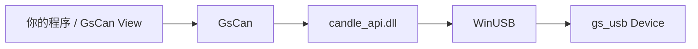

# GsCan.NET

[English](README.md) | **简体中文**

Windows 上的 .NET Standard 2.0 **gs_usb 主机库**。发现 Device、按路 Start Channel、收发 `CanFrame`——不必自己 P/Invoke，也不必再写一套 USB 栈。

本仓库同时寄宿 **GsCan View**，一个消费同一公共面的轻量桌面查看器。GsCan.NET 指的是库，不是分析仪，也不是上位机。

[功能](#功能) · [安装](#安装) · [快速上手](#快速上手) · [GsCan View](#gscan-view) · [构建](#构建) · [许可证](#许可证)


## 为什么做

Windows 上要用托管代码接入 gs_usb，现成可用的主要是 C 的 candle API 和 python-can。没有一份既能打 CAN FD、又对得上这份 native 的 .NET 库。GsCan 把自建的 `candle_api.dll`（经 WinUSB 说 gs_usb）藏在四个类型后面：`Device`、`Channel`、`CanFrame`、`GsCanException`。

第一等设备是 **FlintCAN-FD**（双路隔离 CAN FD、硬件时间戳）。其他标准 gs_usb 设备（CANable、candleLight 等）走同一套 API。



## 功能

- **公共面很小** — 只学 `Device` / `Channel` / `CanFrame`。Candle 不出现在公共名里。
- **经典 CAN 与 CAN FD** — 不设 `DataBitrate` 就是经典；设上（1M / 2M / 4M）即 FD，可发 64 字节帧。
- **多 Channel** — 一块 Device、N 路 Channel（FlintCAN-FD 为两路）。USB IN 的分路藏在库里。
- **发送立刻返回，读取带超时** — `Send` 不阻塞；`TryRead` 超时返回 `false`，不抛。
- **一种帧类型** — Rx、Echo、Error 都是 `CanFrameKind`。Overflow 是某帧上的标志，不是异常。
- **硬件时间戳** — 设备支持时落在 `CanFrame.TimestampMicroseconds`。
- **ListenOnly / Loopback / OneShot** 在 `ChannelOptions` 上。
- **只打 netstandard2.0** — .NET Framework 4.6.1+ 与现代 .NET 共用一份。native 带 `win-x86` / `win-x64`，会拷到输出目录旁。

### 第一版不做

Linux SocketCAN、事件 / `IObservable`、硬件滤波、IDENTIFY、软件端接、`Channel.State`、总线恢复、DBC / UDS / ISO-TP，以及 CAN 分析仪 GUI。GsCan View 是查看器，不是分析仪。

## 环境

- Windows（WinUSB）。库不在 Linux / macOS 上跑。
- 一块 gs_usb 适配器。验收设备是 FlintCAN-FD。
- **使用**库：能引用 `netstandard2.0` 的 TFM 即可。
- **构建**：.NET 8 SDK。重编 native 还需要 Visual Studio C++ 工具与 CMake。

## 安装

库就是本仓库的 `GsCan` 工程（包 id `GsCan`）。尚未上 NuGet 时：

```bash
git clone https://github.com/YeEeck/GsCan.NET.git
dotnet add reference path/to/GsCan.NET/src/GsCan/GsCan.csproj
```

或本地打包：

```bash
dotnet pack src/GsCan/GsCan.csproj -c Release
```

`candle_api.dll` 会自动出现在输出目录旁，不必配置 native 路径。

## 快速上手

```csharp
using GsCan;

var devices = Device.List();          // 当时插着的适配器快照
if (devices.Count == 0)
{
    throw new InvalidOperationException("No gs_usb device found.");
}

using var device = Device.Open(devices[0]);
var ch = device.Channels[0];          // Open 之后 Channel 已在；Start 才上总线

ch.Start(new ChannelOptions
{
    Bitrate = 500_000,
    DataBitrate = 2_000_000,          // 经典 CAN 不要设这个属性
});

ch.Send(CanFrame.Classic(0x123, new byte[] { 0x11, 0x22 }));
ch.Send(CanFrame.Fd(0x124, new byte[64]));

while (ch.TryRead(out var frame, timeoutMilliseconds: 100))
{
    // Kind 是 Rx / Echo / Error —— Echo 不是「上了总线」
    Console.WriteLine($"{frame.Kind} id=0x{frame.Id:X} len={frame.Data.Length}");
}

ch.Stop();                            // void，不抛
```

### Echo、Overflow、Error

| 看见 | 含义 |
|---|---|
| `Kind = Echo` | 这次 `Send` **在设备上结束**。不是已经赢了仲裁。同一 Channel 上 Echo 按 FIFO 对 `Send`。 |
| `Overflow = true` | 设备在这帧之前丢掉了 RX。不是异常，也不是独立类型。 |
| `Kind = Error` | 总线错误帧（含 bus-off）。和数据走同一条收包路径。 |
| `TryRead` → `false` | 超时。打开 / `Start` / 立刻失败的 `Send` 则抛 `GsCanException`。 |

`Stop` 之后未对上的 `Send` 不会再出 Echo。若在乎发送完成，先把 Echo 收完再 Stop。

### 线程

- 同一 Channel 上，`Send` 与 `TryRead` 可以跨线程。
- 同一 Channel 上不能两个 `TryRead` 同时进行。
- `Start` / `Stop` / `Dispose` 必须与收发互斥。
- `List` / `Open` 不保证多线程。使用中拔掉设备时，进行中的调用以 `GsCanException` 失败；没有到达/离开事件。

## API

```csharp
Device.List()                         // IReadOnlyList<DeviceInfo>（Path、ChannelCount）
Device.Open(info)                     // IDisposable

channel.Start(options)
channel.Stop()
channel.Send(frame)
channel.TryRead(out frame, timeoutMs)

ChannelOptions                        // Bitrate、DataBitrate?、ListenOnly、Loopback、OneShot
CanFrame.Classic(id, data, extended?)
CanFrame.Fd(id, data, extended?, bitRateSwitch?)
```

native 认的仲裁 bitrate：10k、20k、50k、83.333k、100k、125k、250k、500k、800k、1M。FD 数据段是 **1M、2M、4M**（48 MHz 时钟）。

## GsCan View

消费 GsCan 的单窗口 Windows x64 查看器。界面中文；Echo / Trace / Latest / Kind 等词条保持英文，和库的术语表对得上。

- 一次只打开一块 Device；Channel 条数量等于该 Device 的路数
- Trace（到达序）与 Latest（按键覆盖并计数）
- Display Filter（只改窗口里看见什么，不是硬件验收滤波）
- TxSlot 表：单次或周期发送
- 把 Trace 存成 CSV（只写；第一版不能打开 Log）
- 记住上次的表单，**不会**自动 Open / Start

从源码运行：

```bash
dotnet run --project src/GsCan.View/GsCan.View.csproj
```

打一份自包含 zip（`GsCan.View.exe` 旁放 `candle_api.dll`，无安装器、不是单文件）：

```powershell
powershell -ExecutionPolicy Bypass -File scripts/publish-view.ps1
```

产物：`artifacts/GsCan.View-win-x64.zip`。解压后运行 `GsCan.View.exe`。可以按 LGPL 替换 exe 旁边那份 `candle_api.dll`。

## 构建

```bash
dotnet build GsCan.sln
dotnet test GsCan.sln
```

没有插适配器时，实机测试会跳过，不会失败。

重编 native（需要 Visual Studio C++ 工具与 CMake）：

```powershell
powershell -ExecutionPolicy Bypass -File native/candle-api/build.ps1
```

会把 `candle_api.dll` 装到 `src/GsCan/runtimes/win-x64/native`，能编 x86 时还有 `win-x86`。

```
src/GsCan/            GsCan 库（netstandard2.0）
src/GsCan.View/       GsCan View（net8.0、Avalonia、win-x64）
tests/                xUnit（库 + 查看器会话）
native/candle-api/    自带的 Candle Windows API（LGPL）
licenses/             GPL-3.0 / LGPL-3.0 文本
CONTEXT.md            术语表 — 提 issue / PR 请用这里的名字
```

## 许可证

native Windows API（`candle_api.dll` 与 `native/candle-api/api/`）是 **LGPL-3.0-or-later**，来自 [Schildkroet/CANgaroo](https://github.com/Schildkroet/CANgaroo) 的 `src/driver/CandleApiDriver/api/`（[commit `46eeb8b`](https://github.com/Schildkroet/CANgaroo/tree/46eeb8b570e5f0cc66a661e9b58cc2f695107807)）。对应源码在仓库内，见 [`native/candle-api/SOURCE.txt`](native/candle-api/SOURCE.txt)。许可证文本：[`licenses/LGPL-3.0.txt`](licenses/LGPL-3.0.txt)、[`licenses/GPL-3.0.txt`](licenses/GPL-3.0.txt)。

GsCan **动态链接**这份 DLL，因此可以替换它。CANgaroo 那个 GPL-2 Qt 应用**没有**打进来。

## 贡献

欢迎 issue 和 PR。请使用 [`CONTEXT.md`](CONTEXT.md) 里的术语（`Device`、`Channel`、`CanFrame`、`Echo`、`Overflow` 等），不要用术语表 _Avoid_ 下列出的同义词。
